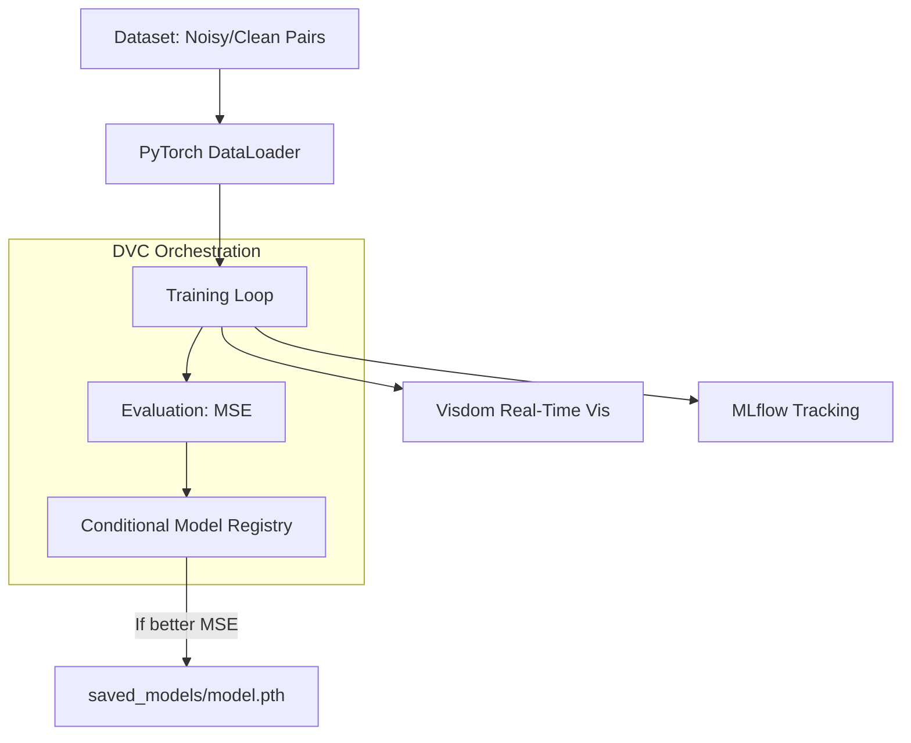

# System Design: Image Denoising Autoencoder

## 1. Overview
The **Image Denoising** system is designed to take images corrupted by noise and output clean, restored versions. It achieves this by passing the noisy images through a Convolutional Autoencoder (or Variational Autoencoder, depending on the configuration) trained to reconstruct the original, uncorrupted image.

## 2. Core Architecture

The architecture treats denoising as a mapping from a noisy pixel space to a clean pixel space, using an information bottleneck to force the model to learn the underlying structure of the images rather than memorizing the noise.

### Model Architecture
- **Encoder**: A series of convolutional layers (`Conv2d`), interspersed with Batch Normalization and ReLU activations. The spatial dimensions are progressively downsampled (e.g., using max pooling or strided convolutions), while the channel depth increases. This creates a compressed latent representation of the image.
- **Bottleneck**: The lowest-dimensional latent space. Because noise is generally high-frequency and random, it cannot easily be compressed. Thus, the bottleneck forces the network to discard the noise and keep only the essential semantic features of the image.
- **Decoder**: A series of transpose convolutional layers (`ConvTranspose2d`). It mirrors the encoder, progressively upsampling the spatial dimensions and decreasing the channel depth back to the original RGB or Grayscale format.

### MLOps Pipeline

1. **DVC**: Orchestrates the dependencies. If the dataset or `params.yaml` changes, DVC knows to re-run the `training` stage.
2. **Visdom**: Used for real-time visual feedback. During training, sample images (Noisy Input $
ightarrow$ Model Output $
ightarrow$ Clean Target) are pushed to the Visdom server to visually verify that the model is learning to denoise without causing blurring.
3. **MLflow**: Automatically logs the learning rate, batch size, optimizer type, and resulting Mean Squared Error (MSE).

## 3. Design Choices & Trade-offs

* **Autoencoder vs. UNet**: Standard autoencoders compress the entire image into a bottleneck, which is great for removing noise but can sometimes lose fine, high-frequency details (causing slight blurring). A UNet architecture (which adds skip connections) could preserve sharper edges, but a pure autoencoder was chosen here for architectural simplicity and as a strong baseline.
* **Mean Squared Error (MSE) Loss**: MSE strongly penalizes large deviations at the pixel level. While it is standard for reconstruction tasks, it can sometimes lead to perceptually blurry outputs. Future iterations could incorporate Perceptual Loss (VGG loss) or SSIM (Structural Similarity Index) to improve human-perceived sharpness.
* **Visdom vs TensorBoard**: Visdom was chosen specifically for its lightweight, highly interactive image rendering capabilities, which is crucial for a computer vision reconstruction task where visual inspection of the output is as important as the loss metric.
